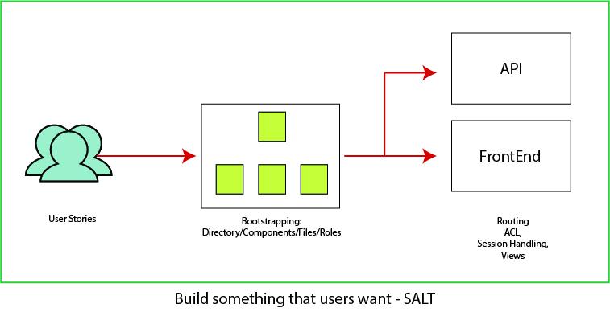

### Build something that users want - SALT
The goal of the framework is to design applications based on user stories
The framework has an easy interface to graphically organize code based on user stories.Having a one to one mapping of how users will use the application and how code is organized helps in faster developement, writing reliable and testable software and long term maintainability. 

